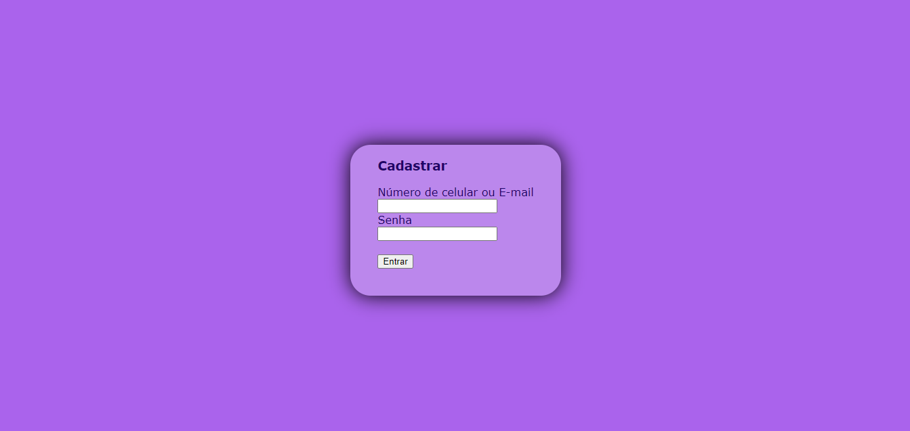
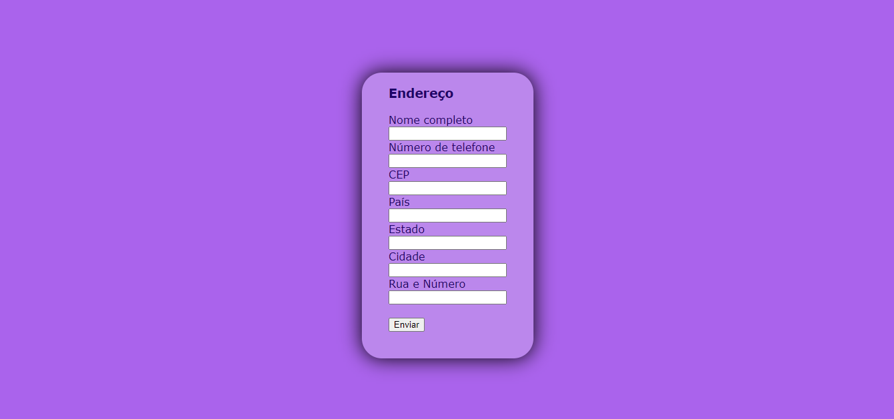
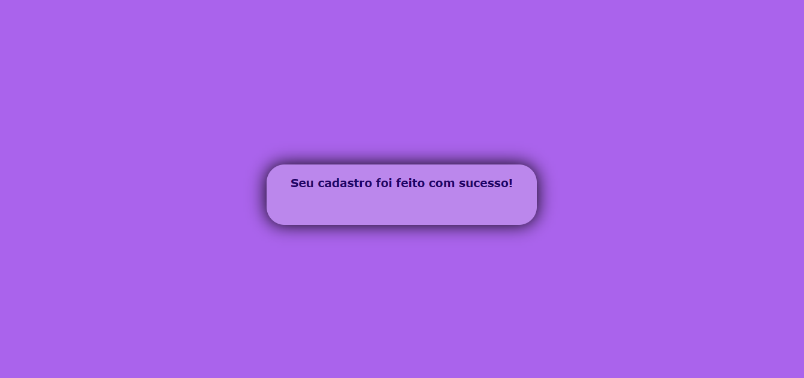
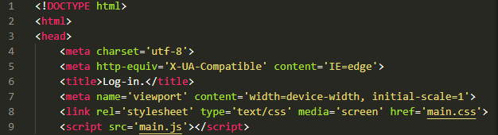
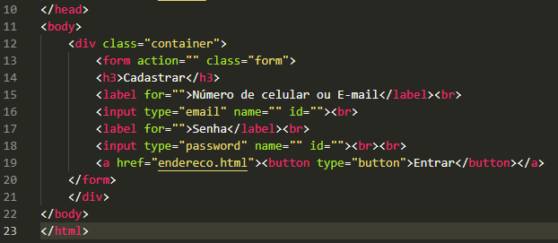

# Projeto - Formulário de Cadastro Ecommerce.

Projeto criado como parte da disciplina de Fundamentos de Desenvolvimento, ministrada pelo professor Leonardo Rocha.

## Índice

* [Descrição](#descrição)
* [Tecnologias](#tecnologias)
* [Referências](#referencias)
* [Autor(a)](#autora)

### Descrição

O projeto consiste na composição de uma página de "Log-in", "Endereço" e "Conclusão", para que o usuário insira informações sensíveis para se cadastrar em um site de compras.

### Resultado do projeto.

### Contato 

* DOCTYPE - É uma instrução para o navegador da web que diz em qual versão do HTML a página é escrita.
* Main - Define o título do documento, mostrado na barra de título de um navegador ou na aba da página.
* Link - Especifica as relações entre o documento atual e um recurso externo.
* Meta - Define qualquer informação de metadados que não podem ser definidos por outros elementos HTML.
* title - Define o título do documento, mostrado na barra de título de um navegador ou na aba da página.
Veja a seguir uma imagem de parte do código, onde é possível identificar o uso dos elementos mencionados a cima:

* Head - Providencia informações gerais (metadados) sobre o documento, incluindo seu título e links para scripts e folhas de estilos.
* body - Define tudo o que aparece na página.
* br - Cria uma quebra de linha em um texto.
* form - Serve para criar formulários e definir a forma como eles se comportam.
* label - Especifica o rótulo de um input em um formulário, e é importante para a experiência de um usuário.
* input - Serve para criar campos de entrada de dados interativos, que permitem o usuário insira textos, números, datas, cores, entre outros.
* a - com o atributo href cria-se um hiperligação nas páginas web.
* button - Insere botões clicáveis em páginas e formulários, que podem executar ações quando um usuário clica neles.
A seguir, mais uma imagem de parte do código, onde se visualiza os elementos usados a cima:

### Estilização

O projeto foi estilizado, utilizando CSS3. Foi criado um arquivo chamado login.css. Neste arquivo, constam as seguintes configurações de estilo:

